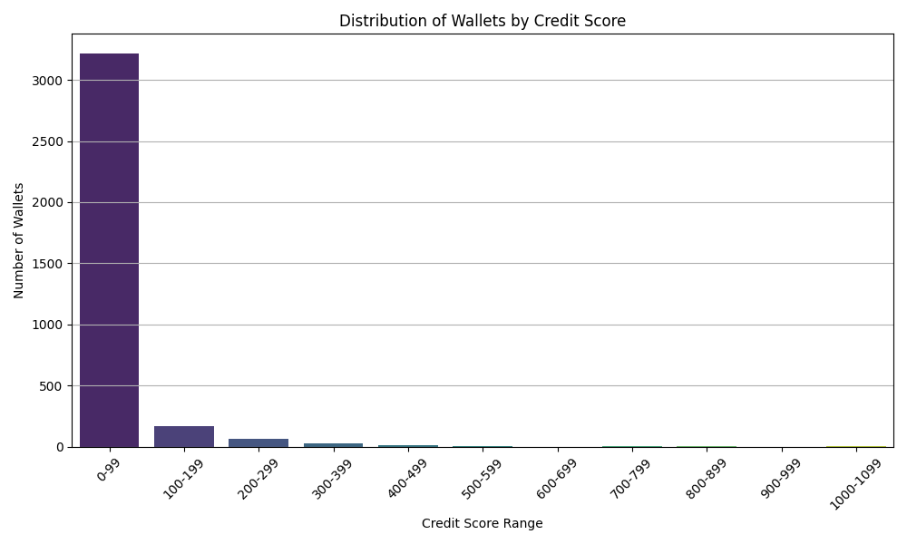

# Analysis of Wallet Credit Scores

## Score Distribution

Wallets were grouped into score buckets from 0 to 1000. The distribution is as follows:

| Score Range | Meaning              | Wallet Count |
|-------------|----------------------|--------------|
| 0–99        | High Risk (Bots)     | 3216         |
| 100–199     | Very Risky           | 169          |
| 200–299     | Risky / Inactive     | 65           |
| 300–499     | Below Average        | 34           |
| 500–699     | Average              | 07           |
| 700–899     | Good Behavior        | 05           |
| 900–1000    | Excellent, Reliable  | 01           |

## Observations

-  ## Low Scoring Wallets**:
  - Tend to make only 1–2 transactions.
  - No repayment activity.
  - Appear inactive or bot-like.
  - Often exhibit only borrow or redeem activity.

-  ## High Scoring Wallets**:
  - High frequency and consistency of transactions.
  - Strong repay-to-borrow ratios.
  - Fewer or no liquidation events.
  - Long activity span (weeks or months).

## Visual

